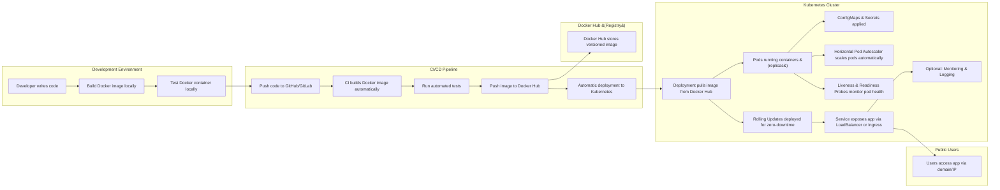

# Kubernetes flow diagram

```mermaid
flowchart LR
    %% Development Environment
    subgraph DEV["Development Environment"]
        A[Developer writes code] --> B[Build Docker image locally]
        B --> C[Test Docker container locally]
    end

    %% CI/CD Pipeline
    subgraph CICD["CI/CD Pipeline"]
        D[Push code to GitHub/GitLab] --> E[CI builds Docker image automatically]
        E --> F[Run automated tests]
        F --> G[Push image to Docker Hub]
        G --> H[Automatic deployment to Kubernetes]
    end

    %% Docker Hub (Registry)
    subgraph REGI["Docker Hub &#40;Registry&#41;"]
        G --> I[Docker Hub stores versioned image]
    end

    %% Kubernetes Cluster
    subgraph K8S["Kubernetes Cluster"]
        H --> J[Deployment pulls image from Docker Hub]
        J --> K[Pods running containers &#40;replicas&#41;]
        K --> L[ConfigMaps & Secrets applied]
        K --> M[Horizontal Pod Autoscaler scales pods automatically]
        K --> N[Liveness & Readiness Probes monitor pod health]
        J --> O[Rolling Updates deployed for zero-downtime]
        O --> P[Service exposes app via LoadBalancer or Ingress]
        P --> Q[Optional: Monitoring & Logging]
    end

    %% Public Users
    subgraph USERS["Public Users"]
        P --> R[Users access app via domain/IP]
    end

    %% Connect Development to CI/CD
    C --> D
```
